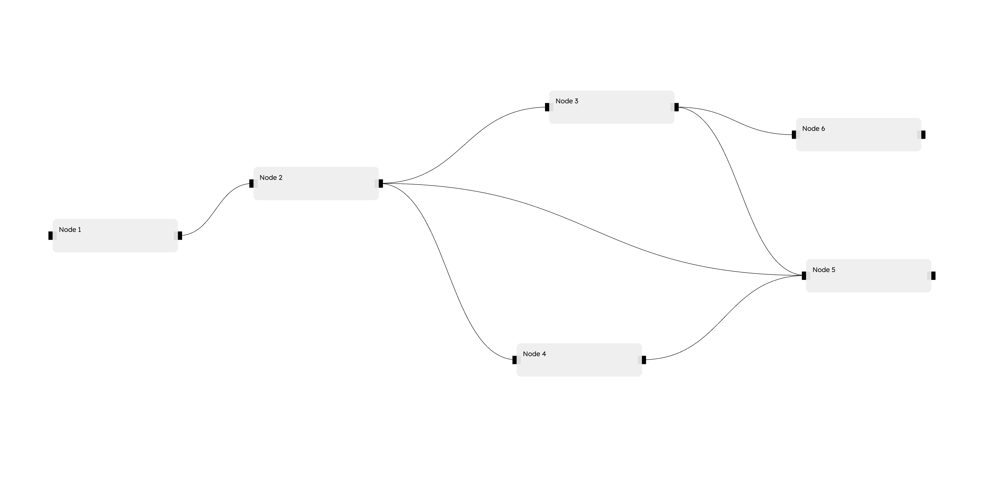

# FullyLinked 
## A simple library for visualising graphs using DOM elements


### 🎉 Features

- ✅ Written with [TypeScript](https://www.typescriptlang.org/) so it is type-safe
- ✅ Draggable nodes
- ✅ Add edges dynamically with drag & drop
- ✅ Zoomable & draggable canvas
- ✅ Nodes can be any HTML elements (e.g. `<div>` or ``) or even a React component
- ✅ Add nodes dynamically with drag & drop (coming soon)
- ✅ Extend with graph layouts, including DAG, force-directed, or a custom layout (coming soon)
- ✅ Customizable edge styles (coming soon)
- ✅ Events (coming soon):
  - 🎉 `nodeClick`: when a node is clicked
  - 🎉 `nodeDrag`: when a node is dragged
  - 🎉 `nodeDragEnd`: when a node is dropped
  - 🎉 `edgeClick`: when an edge is clicked
  - 🎉 `canvasClick`: when the canvas is clicked
  - 🎉 `canvasDrag`: when the canvas is dragged
  - 🎉 `canvasDragEnd`: when the canvas is dropped
  - 🎉 `canvasZoom`: when the canvas is zoomed
  - 🎉 `canvasZoomEnd`: when the canvas is zoomed

### 🔀 Example FullyLinked Graph


### ℹ️ Get started

1. First, install the library

```bash
npm install fully-linked
```

2. Then import it
```typescript
import { FullyLinked } from 'fully-linked'
```

3. Use it
```typescript

// Create an interface for our node data
interface MyNodeDataType {
  id: string;
  label: string;
}

// Create an interface for our edge data
interface MyEdgeDataType {
  id: string;
  label: string;
}


// Get the container element. This can be any HTML div element. 
// It must have a width and height so that the graph can be visible.
const container = document.getElementById("container");
if (!container) {
    // ... handle container not found
}

// Create a new FullLinked instance
const fl = new FullyLinked<MyNodeDataType, MyEdgeDataType>({
  // Each graph must have a unique ID
  id: "my-fl-graph",
  // The container element must be passed in
  container,
});

// A function to create your node template. 
// Returns an HTML element.
const getNodeElement = (node: InternalNode<MyNodeDataType>) => {
  // Create a blank div element as our node container
  const nodeElement = document.createElement("div");

  // Set the node container's styles
  nodeElement.style.width = `${node.width}px`;
  nodeElement.style.height = `${node.height}px`;
  nodeElement.style.backgroundColor = "#eeee";
  nodeElement.style.borderRadius = "10px";

  // Add node content
  const content = document.createElement('div');
  content.style.padding = "15px";
  content.innerText = node.data.label;

  // Append the node content to the node container
  nodeElement.appendChild(content);

  // Return the node container
  return nodeElement;
};

// Set graph data
fl.setData({
  nodes: [
    {
      // Each node must have a unique id
      id: "1",
      // Each node must have a width and a height  
      width: 300,
      height: 80,
      // Initial positions of the node
      x: 50,
      y: 50,
      // Pass any data you want to store in the node
      data: { id: "1", label: "Node 1" },
      // The node template is a function that returns an HTML element (created above)
      customNodeElement: getNodeElement
    },
    {
      id: "2",
      width: 300,
      height: 80,
      x: 500,
      y: 250,
      data: { id: "2", label: "Node 2" },
      customNodeElement: getNodeElement
    },
    {
      id: "3",
      width: 300,
      height: 80,
      x: 50,
      y: 450,
      data: { id: "3", label: "Node 3" },
      customNodeElement: getNodeElement
    },
    {
      id: "4",
      width: 300,
      height: 80,
      x: 50,
      y: 650,
      data: { id: "4", label: "Node 4" },
      customNodeElement: getNodeElement
    },
    {
      id: "5",
      width: 300,
      height: 80,
      x: 50,
      y: 850,
      data: { id: "5", label: "Node 5" },
      customNodeElement: getNodeElement
    },
    {
      id: "6",
      width: 300,
      height: 80,
      x: 50,
      y: 1000,
      data: { id: "6", label: "Node 6" },
      customNodeElement: getNodeElement
    }
  ],
  edges: [
    { 
        // An edge must have a unique ID
        id: "1", 
        // The source and target nodes of the edge
        source: "1",
        target: "2",
        // Pass any data you want to store in the edge
        data: { 
            id: "1", 
            label: "Edge 1" 
        } 
    },
    { id: "2", source: "2", target: "3", data: { id: "2", label: "Edge 2" } },
    { id: "3", source: "2", target: "4", data: { id: "3", label: "Edge 3" } },
    { id: "4", source: "4", target: "5", data: { id: "4", label: "Edge 4" } },
  ],
  // Each data object must have a unique id
  id: "test",
});


// Render the graph into the container element
fl.render();

```